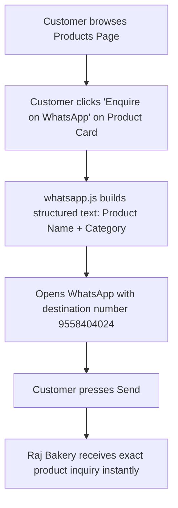
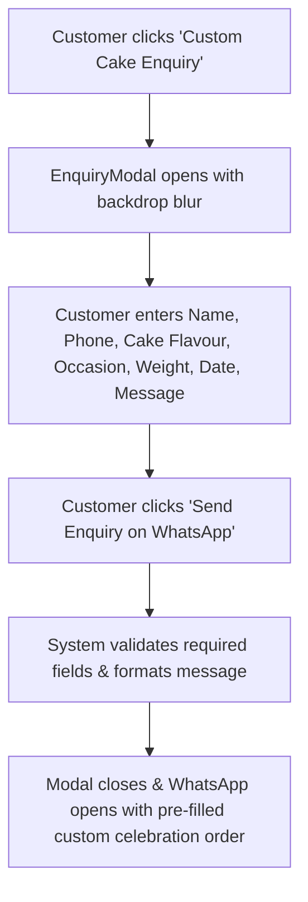

# Raj Bakery — Product Requirements Document (PRD)

## 1. Product Overview & Purpose

### 1.1 Executive Summary
**Raj Bakery** is an established, beloved neighbourhood bakery brand with two prominent locations in Pune, Maharashtra (**Kondhwa** and **Sukhsagar Nagar**). The Raj Bakery Web Platform is a customer-facing, mobile-first web application engineered to showcase the bakery's authentic products, build brand credibility with authentic client photographs, guide physical store visits, and generate high-conversion customer orders directly through WhatsApp.

### 1.2 Core Objectives
- **Showcase Real Craftsmanship**: Present 50+ real Raj Bakery product photographs and custom celebration cakes without stock or artificial AI placeholders.
- **Mobile-First Customer Experience**: Provide an app-like experience on smartphones across Chrome, Safari, Instagram In-App browser, WhatsApp browser, and Google Search.
- **Fast, Sub-Second Performance**: Load under 1.5s on mobile 4G/5G connections by utilizing WebP image compression, lazy loading, and edge caching.
- **Zero-Friction Inquiries**: Convert browsing customers into direct sales through pre-formatted 1-tap WhatsApp enquiries.
- **Clear Dietary Governance**: Clearly communicate branch-specific dietary offerings: **Sukhsagar Nagar (100% Pure Vegetarian)** and **Kondhwa (Veg & Non-Veg Both)**.

---

## 2. Target Audience & User Personas

| Persona | Description | Primary Goal on Website | Key Features Used |
| :--- | :--- | :--- | :--- |
| **Birthday / Party Planner** | Parents, friends, or spouses organising celebrations in Pune | Explore custom cakes, check designs, and enquire about availability & price | Special Cakes, Custom Cake Modal, WhatsApp Enquiry |
| **Daily Tea-Time Shopper** | Local residents looking for daily fresh bakes | Check availability of Khari, Toast, Butter Cookies, and Breads | Products Catalog, Category Filter, Search Bar |
| **Store Visitor / Commuter** | Customers travelling in Kondhwa or Katraj | Find exact branch addresses, phone numbers, and driving directions | Find Us, Location Cards, Google Maps Navigation, Call Buttons |
| **Dietary-Conscious Buyer** | Vegetarian customers seeking strict pure veg bakes | Confirm vegetarian authenticity before visiting | Top Announcement Bar, Dietary Badges, Branch Dietary Indicators |

---

## 3. Brand & Business Rules

### 3.1 Business Information
- **Brand Name**: Raj Bakery
- **Tagline**: *"Freshness Baked Into Every Moment"*
- **Sub-tagline**: *"Welcome to Raj Bakery — your destination for daily bakery favourites, handmade cookies, crispy khari, and celebration cakes made for every occasion in Pune."*
- **Active Testing WhatsApp Number**: `9558404024` (Configured in `src/config/business.js` for instant testing)
- **Production Main Contact (Orders & Enquiries)**: **Nadeem Ansari** (`7020812151`)

### 3.2 Branch Locations & Dietary Rules
1. **Sukhsagar Nagar Branch**:
   - **Address**: Sukhsagar Nagar, Katraj, Pune, Maharashtra – 411046
   - **Dietary Status**: **100% Pure Vegetarian** (Strict pure veg facility).
   - **Symbol**: Standard Green Square with Green Circle (FSSAI).
   - **Google Maps**: [https://maps.app.goo.gl/zuttigUacWmgKD5s7](https://maps.app.goo.gl/zuttigUacWmgKD5s7)
2. **Kondhwa Branch (Main Branch)**:
   - **Address**: Shop No 2, Akshar Dham Soc, Saibaba Nagar, Kondhwa, Pune, Maharashtra – 411048
   - **Dietary Status**: **Veg & Non-Veg Both** (Full bakery range).
   - **Symbol**: Unified Green Square + Brown Square side-by-side.
   - **Google Maps**: [https://maps.app.goo.gl/qPyZMEZvNJGkTA176](https://maps.app.goo.gl/qPyZMEZvNJGkTA176)

### 3.3 Contact Persons Directory
- **Nadeem Ansari**: `7020812151` (*Main Contact for Orders & Product Enquiries*)
- **Riyasat Ansari**: `8788950429` (*Store Contact*)
- **Tanveer Ansari**: `8446632570` (*Store Contact*)

---

## 4. Page-by-Page Specifications

### 4.1 Home Page (`/`)
- **Top Announcement Bar**: Displays Sukhsagar Nagar Pure Veg and Kondhwa Veg & Non-Veg badges with uniform standardized FSSAI dietary icons.
- **Hero Section**: Storefront hero image with dark vignette overlay, Pune bake badge, value propositions, and CTA buttons (*Explore Products*, *Enquire on WhatsApp*, *Find Bakery*).
- **Welcome & Bakery Story**: Warm interior photo, 2-column overview of bakery heritage, daily fresh bakes, and custom cakes.
- **Featured Bakery Delights**: Top 8 plated bakery products in a responsive grid.
- **Special Celebration Cakes Showcase**: Highlighted celebration cakes with *Custom Cake Enquiry* modal launcher.
- **The Raj Bakery Promise (6 Features)**: Freshly Prepared, Quality Ingredients, Delicious Taste, Cakes for Every Occasion, Custom Cake Enquiries, Customer-Friendly Service.
- **Photo Gallery with Lightbox**: Interactive gallery of store ambience, cake displays, and cookies with touch-swipe lightbox support.
- **Two Store Locations Summary**: Location cards with direct Google Maps and *Get Directions* links.
- **Global CTA Banner**: High-impact footer CTA for celebration cakes and direct WhatsApp messaging.

### 4.2 About Us Page (`/about`)
- **Header Banner**: Warm brand storytelling header.
- **Visual Store Showcase**: High-res Kondhwa storefront image paired with Sukhsagar and display counter images.
- **Bakery Craft & Story**: Heritage narrative explaining traditional baking methods, consistency, and customer service.
- **Occasion Highlights**: Dedicated feature cards for *Birthdays & Anniversaries*, *Weddings & Grand Events*, and *Tea-Time & Daily Snacks*.
- **Branch Profile Cards**: Detailed summary of both bakery branches with direct map navigation links.

### 4.3 Products Catalog Page (`/products`)
- **Header**: Visual banner celebrating fresh daily bakes.
- **Real-Time Search Bar**: Instant client-side filtering by product name and description with a 1-tap clear button.
- **Horizontally Scrollable Category Chips**:
  - Categories: *All*, *Khari & Toast*, *Biscuits & Cookies*, *Pastries & Cakes*, *Cream Rolls*, *Breads & Pav*, *Pizza & Burger Buns*, *Sweet Pav & Donuts*, *Special Delights*.
  - Unclipped edge padding ensuring *"All"* and *"Special Delights"* remain 100% visible on all viewports.
- **Product Card Grid**:
  - Small mobile: 1 column
  - Larger mobile ($390\text{px}+$): 2 columns
  - Tablet / Desktop: 3 to 4 columns
  - 1:1 Aspect ratio real product photos with skeleton shimmer placeholders.
  - Category pill + Pure Veg badge.
  - Multi-line wrapped product title (e.g. *Special Coconut Macaroon (Makrun)*).
  - 1-Tap *Enquire on WhatsApp* button pre-filling product name and category.

### 4.4 Special Celebration Cakes Page (`/special-cakes`)
- **Header Banner**: Celebration cake branding with *Custom Cake Enquiry Form* CTA.
- **Category Filter Chips**: *All*, *Birthday Cakes*, *Anniversary Cakes*, *Wedding Cakes*, *Kids & Theme Cakes*, *Chocolate Delights*.
- **Cakes Grid**: Detailed cake cards displaying cake design, flavor description, *Ideal For* occasion tag, and WhatsApp enquiry button.
- **3-Step Order Guide**:
  1. *Choose Design & Flavour*
  2. *Confirm via WhatsApp*
  3. *Pickup Fresh at Pune Branch*

### 4.5 Find Us Page (`/find-us`)
- **Header Banner**: Store locator header.
- **Branch Location Cards**:
  - Kondhwa Branch Card with storefront photo, complete address, Veg & Non-Veg badge, Google Maps button, and Directions button.
  - Sukhsagar Nagar Branch Card with storefront photo, complete address, 100% Pure Veg badge, Google Maps button, and Directions button.
- **Bulk Order / Pickup Planning Box**: FAQ guidance on reserving celebration cakes and daily batches beforehand via WhatsApp.

### 4.6 Contact Page (`/contact`)
- **Orders & Product Enquiries Highlight**: Prominent VIP card for **Nadeem Ansari** (`7020812151`) with direct WhatsApp and Call buttons.
- **All 3 Bakery Contacts Grid**: Cards for Riyasat Ansari, Tanveer Ansari, and Nadeem Ansari with clickable phone (`tel:`) and WhatsApp buttons.
- **Interactive Contact Form**:
  - Fields: Full Name, Phone Number, Email (Optional), Subject Dropdown, Message.
  - Form submission compiles all fields and opens WhatsApp with pre-filled enquiry text.

---

## 5. Functional Requirements & User Flows

### 5.1 Product WhatsApp Enquiry Flow

### 5.2 Custom Cake Multi-Step Enquiry Flow

---

## 6. Non-Functional Requirements

### 6.1 Performance & Image Optimization
- **Payload Reduction**: Total product image catalog size reduced from **298.00 MB to 6.86 MB** (**97.7% reduction**).
- **Modern Formats**: WebP compression (quality 80-82) with responsive srcset variants (`320w`, `480w`, `640w`, `960w`, `1200w`, `1920w`).
- **Core Web Vitals Target**:
  - Largest Contentful Paint (LCP): $< 1.8\text{s}$
  - Cumulative Layout Shift (CLS): **$0.00$** (Strict fixed aspect ratios)
  - Total Blocking Time (TBT): $< 100\text{ms}$
  - First Input Delay / INP: $< 50\text{ms}$
- **Lazy Loading**: `loading="lazy"` and `decoding="async"` on all below-the-fold media. Eager loading and `fetchpriority="high"` strictly reserved for hero storefront.

### 6.2 Mobile Ergonomics & Responsive Breakpoints
- **Supported Widths**: $320\text{px}$, $360\text{px}$, $375\text{px}$, $390\text{px}$, $393\text{px}$, $412\text{px}$, $430\text{px}$, $480\text{px}$, $768\text{px}$, $1024\text{px}$, $1280\text{px}$, $1440\text{px}$.
- **Touch Target Standard**: Minimum height and width of **$44\text{px} - 48\text{px}$** for all buttons, inputs, links, and chips.
- **Safe Area Support**: `env(safe-area-inset-bottom)` applied to mobile sticky navigation bar.
- **PWA Capabilities**: `manifest.webmanifest` configured with standalone mode, brand theme color `#0F4C47`, and background `#FFFDF7`.

### 6.3 Accessibility (a11y)
- Standard semantic HTML5 (`<header>`, `<main>`, `<nav>`, `<section>`, `<footer>`, `<button>`, `<a>`).
- All interactive elements include explicit `aria-label` and `aria-expanded` attributes.
- High contrast ratios complying with WCAG 2.1 AA guidelines (Dark forest green `#0F4C47`, warm amber `#D97706`, white `#FFFFFF`, deep espresso `#2A1810`).
- Keyboard navigation (Tab focus rings, `Escape` key listeners on modals and drawers).

### 6.4 SEO & Social Metadata
- Optimized title tags and meta descriptions tailored for Pune bakery searches.
- Open Graph protocol (`og:title`, `og:description`, `og:image`, `og:type`) for rich previews when shared on WhatsApp, Facebook, and Instagram.

---

## 7. QA Acceptance Criteria & Verification Matrix

| Area | Verification Test | Expected Result | Status |
| :--- | :--- | :--- | :--- |
| **Category Chips** | View `/products` and `/special-cakes` across mobile and desktop | "All" (left) and "Special Delights" (right) are fully visible without clipping | **PASS** |
| **Dietary Symbols** | Inspect top announcement bar, hero, location cards, and footer | Pure Veg and Veg & Non-Veg symbols share identical square sizes, borders, and dots | **PASS** |
| **Image Loading** | Browse catalog on simulated 4G network | WebP images load progressively with shimmer placeholder and 0 CLS | **PASS** |
| **WhatsApp Routing** | Click product card and cake enquiry buttons | Opens WhatsApp with pre-filled product name and category | **PASS** |
| **Store Navigation** | Click *View Location* and *Get Directions* on Location Cards | Directly opens official Google Maps coordinates for Kondhwa/Sukhsagar | **PASS** |
| **Phone Links** | Click phone numbers across Contact and Footer | Initiates native phone dialer with formatted `tel:+91...` numbers | **PASS** |
| **Production Build**| Run `npm run build` | Builds cleanly with 0 TypeScript/Rollup errors in $< 2\text{s}$ | **PASS** |

---

## 8. Future Roadmap

1. **Phase 1 (Current)**: High-speed responsive web catalog, WebP image pipeline, standardized dietary system, and WhatsApp ordering funnel.
2. **Phase 2 (Near-Term)**: Direct WhatsApp catalog sync, customer review integration from Google My Business, and automated seasonal festival specials banner.
3. **Phase 3 (Long-Term)**: Optional digital payments via UPI/Razorpay and customer loyalty program for Pune repeat buyers.
