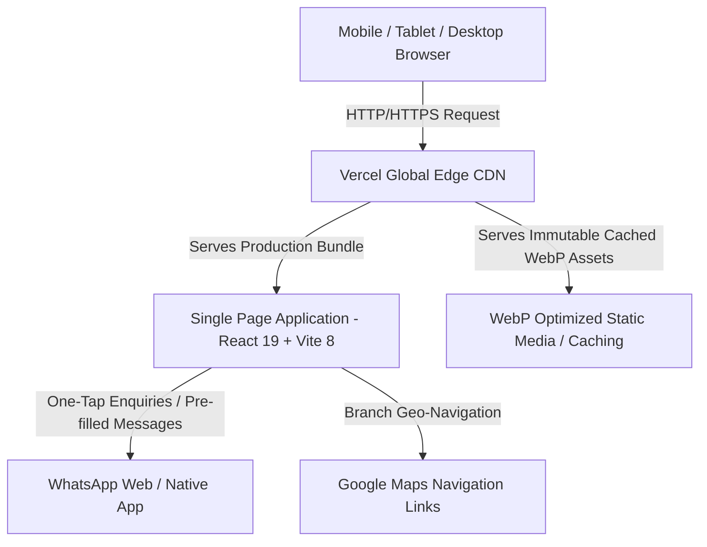
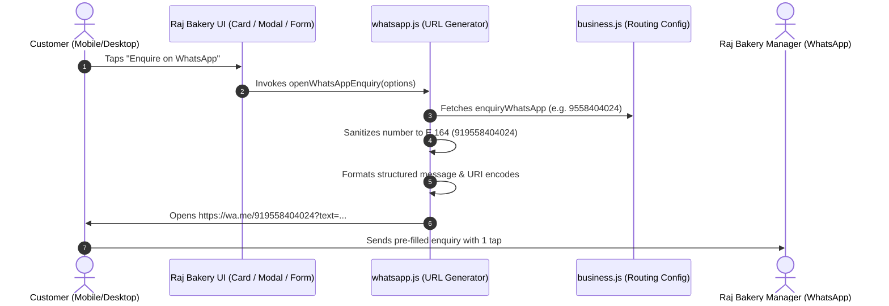

# Raj Bakery — Technical System Architecture

## 1. Architecture Overview & Design Principles

**Raj Bakery** is a modern, high-performance, mobile-first web application designed for a premier bakery business in Pune, Maharashtra. The application serves as a dynamic digital storefront, digital product catalog (50+ real bakery products and celebration cakes), store locator (Kondhwa and Sukhsagar Nagar branches), and an instant customer acquisition funnel via WhatsApp-based ordering.



### Core Architecture Principles
1. **Real-Asset Preservation & Modernization**: 100% of real client photographs are preserved in pristine quality in `public/images/original/`, while a high-efficiency WebP responsive asset pipeline serves lightweight images (`public/images/optimized/`), reducing payload by **97.7%**.
2. **Mobile-First App-Like Ergonomics**: Designed primarily for mobile screen dimensions ($320\text{px} - 480\text{px}$) with $\ge 48\text{px}$ touch targets, smooth slide-out drawers, horizontal scroll chip containers, and a sticky mobile action bar supporting hardware safe area insets (`env(safe-area-inset-bottom)`).
3. **Frictionless WhatsApp Conversion Engine**: Eliminates cart friction, payment gateways, and checkout drop-offs by routing all customer product queries, custom cake requests, and bulk order enquiries directly to bakery managers via pre-filled WhatsApp messages.
4. **Zero Layout Shift (CLS: 0)**: All image containers enforce rigid aspect ratios (`aspect-ratio: 1 / 1` for products/cakes, `16 / 9` for heroes/banners) coupled with shimmer placeholders.
5. **Standardized Dietary Governance**: Indian food safety (FSSAI) vegetarian and non-vegetarian symbols are strictly standardized with identical dimensions and styles across the entire application.

---

## 2. Technology Stack

| Layer | Technology | Version / Specification | Rationale |
| :--- | :--- | :--- | :--- |
| **Runtime & Core** | React | `^19.2.8` | Declarative component model, automatic batching, modern concurrency |
| **DOM Renderer** | React DOM | `^19.2.8` | Core web rendering engine |
| **Build & Dev Tool** | Vite | `^8.3.0` | Ultra-fast ESM-based HMR, Rollup bundling, lightning-fast production builds |
| **Styling Framework** | Tailwind CSS (v4) | `^4.3.3` (`@tailwindcss/vite`) | Modern CSS-in-JS engine with zero runtime overhead, arbitrary properties, and container query support |
| **Client-Side Routing**| React Router DOM | `^7.18.4` | Client-side SPA navigation with smooth page transitions and history management |
| **Iconography** | Lucide React | `^1.47.0` | Crisp, scalable, tree-shakeable SVG icons |
| **Image Processing** | Sharp | `^0.34.x` | Native high-performance image optimization (WebP conversion, EXIF auto-rotation, multi-breakpoint resizing) |
| **Linting & Quality** | Oxlint | `^1.81.0` | Ultra-fast Rust-based static code linter |
| **PWA & Mobile** | Web App Manifest | `manifest.webmanifest` | Standalone display mode, theme branding, mobile icon masking |
| **Hosting & Edge** | Vercel CDN | `vercel.json` | Global edge distribution, SPA route rewrites, 1-year immutable asset caching |

---

## 3. Directory & Project Structure

```
Raj_Bakery_website/
├── public/                                # Static assets served at root
│   ├── favicon.svg                        # Brand vector favicon
│   ├── icons.svg                          # Additional SVG vector symbols
│   ├── manifest.webmanifest               # Web App Manifest for mobile PWA support
│   └── images/                            # Central image storage
│       ├── original/                      # UNTOUCHED, preserved original client photographs
│       │   ├── bakery/                    # Storefronts, interiors (high-res JPEGs)
│       │   ├── cakes/                     # Celebration cakes (high-res JPEGs)
│       │   └── products/                  # 80+ product shots (high-res JPEGs)
│       ├── optimized/                     # Generated WebP web assets (quality 80-85)
│       │   ├── bakery/                    # WebP versions + responsive sizes (480w, 768w, 1200w, 1920w)
│       │   ├── cakes/                     # WebP versions + responsive sizes (320w, 480w, 640w, 960w)
│       │   └── products/                  # WebP versions + responsive sizes (320w, 480w, 640w, 960w)
│       ├── bakery/                        # Fallback legacy paths
│       ├── cakes/                         # Fallback legacy paths
│       └── products/                      # Fallback legacy paths
├── scripts/                               # Node.js automation pipelines
│   ├── optimize-images.js                 # Sharp-based image optimization & statistics script
│   └── update-data-paths.js               # Data synchronization script for asset paths
├── src/                                   # Application source code
│   ├── assets/                            # Static asset imports
│   ├── components/                        # Reusable UI component library
│   │   ├── CakeCard.jsx                   # Celebration cake catalog card
│   │   ├── ContactForm.jsx                # Interactive enquiry preparation form
│   │   ├── CTASection.jsx                 # Global high-conversion call-to-action banner
│   │   ├── DietarySymbol.jsx              # Standardized Pure Veg & Non-Veg FSSAI symbols
│   │   ├── EnquiryModal.jsx               # Custom celebration cake multi-step enquiry modal
│   │   ├── Footer.jsx                     # Multi-column semantic footer with dietary badges
│   │   ├── Hero.jsx                       # Storefront hero banner with dark vignette & CTAs
│   │   ├── LightboxModal.jsx              # Touch-swipeable photo gallery lightbox
│   │   ├── LocationCard.jsx               # Store branch card with direct Google Maps links
│   │   ├── Navbar.jsx                     # Top announcement bar + sticky navigation header
│   │   ├── OptimizedImage.jsx             # Responsive WebP image component with skeleton fallback
│   │   ├── ProductCard.jsx                # Product card with 1:1 image, category pill & WhatsApp CTA
│   │   ├── ScrollToTop.jsx                # Route change scroll reset handler
│   │   ├── SectionHeading.jsx             # Reusable typography and section header
│   │   ├── StickyMobileBar.jsx            # Mobile-only sticky bottom action bar (WhatsApp, Call, Map)
│   │   └── WhatsAppEnquiryButton.jsx      # Reusable WhatsApp action button with dynamic message payloads
│   ├── config/                            # Central configuration
│   │   └── business.js                    # Business details, branch info, phone numbers & contacts
│   ├── data/                              # Static data models
│   │   ├── cakes.js                       # Special celebration cakes catalog
│   │   ├── gallery.js                     # Storefront & bakery gallery images
│   │   ├── locations.js                   # Kondhwa & Sukhsagar branch addresses, maps & dietary types
│   │   └── products.js                    # 50+ categorized bakery items
│   ├── pages/                             # Page-level route views
│   │   ├── About.jsx                      # Bakery history, craftsmanship & branch profiles
│   │   ├── Contact.jsx                    # Contact person directory, direct calling & enquiry form
│   │   ├── FindUs.jsx                     # 2 Pune store locations, maps & directions
│   │   ├── Home.jsx                       # Main landing view, featured bakes & highlights
│   │   ├── Products.jsx                   # Full product catalog with search & category filters
│   │   └── SpecialCakes.jsx               # Cake gallery, ordering guide & custom order trigger
│   ├── utils/                             # Helper utilities
│   │   └── whatsapp.js                    # WhatsApp URL generator, number sanitizer & message builder
│   ├── App.css                            # Component specific styling rules
│   ├── App.jsx                            # Root application component, routing setup & global modal
│   ├── index.css                          # Tailwind CSS imports, base font definitions, utility classes
│   └── main.jsx                           # Application entrypoint (React DOM mount)
├── index.html                             # Single page HTML document with Open Graph & PWA meta
├── package.json                           # Dependencies, build scripts & project metadata
├── vercel.json                            # Vercel deployment configuration & static caching rules
└── vite.config.js                         # Vite build pipeline & Tailwind v4 plugin configuration
```

---

## 4. Component Hierarchy & Flow

```mermaid
graph TD
    App[App.jsx]
    App --> ScrollToTop[ScrollToTop.jsx]
    App --> Navbar[Navbar.jsx]
    Navbar --> DietaryTop[DietarySymbol.jsx (Announcement Bar)]
    Navbar --> NavLinks[Navigation Links & Drawer]

    App --> MainRouter[React Router &lt;Routes&gt;]
    MainRouter --> Home[Home.jsx]
    MainRouter --> About[About.jsx]
    MainRouter --> Products[Products.jsx]
    MainRouter --> SpecialCakes[SpecialCakes.jsx]
    MainRouter --> FindUs[FindUs.jsx]
    MainRouter --> Contact[Contact.jsx]

    Home --> Hero[Hero.jsx]
    Hero --> DietaryHero[DietarySymbol.jsx]
    Home --> ProductCardList[ProductCard.jsx &times; N]
    Home --> CakeCardList[CakeCard.jsx &times; N]
    Home --> GalleryGrid[OptimizedImage.jsx in Lightbox Trigger]
    Home --> LocationList[LocationCard.jsx &times; 2]

    Products --> CategoryChips[Horizontal Scroll Filter]
    Products --> SearchInput[Real-time Search Filter]
    Products --> ProductGrid[ProductCard.jsx &times; N]
    ProductCardList --> OptimizedImage[OptimizedImage.jsx]
    ProductCardList --> WhatsAppEnquiryButton[WhatsAppEnquiryButton.jsx]

    App --> Footer[Footer.jsx]
    Footer --> DietaryFooter[DietarySymbol.jsx]
    App --> StickyMobileBar[StickyMobileBar.jsx (Mobile Viewport Only)]
    App --> EnquiryModal[EnquiryModal.jsx (Global Custom Cake Modal)]
    Home --> LightboxModal[LightboxModal.jsx]
```

---

## 5. Data Architecture & Schemas

The application utilizes centralized, type-consistent JavaScript data structures.

### 5.1 Business Configuration (`src/config/business.js`)
```javascript
export const businessInfo = {
  name: "Raj Bakery",
  tagline: "Freshness Baked Into Every Moment",
  subTagline: "...",
  enquiryWhatsApp: "9558404024", // Active testing WhatsApp router (switchable to 7020812151)
  mainContact: {
    name: "Nadeem Ansari",
    phone: "7020812151",
    role: "Main Contact for Orders & Enquiries",
    isMainContact: true
  },
  contacts: [
    { id: "riyasat", name: "Riyasat Ansari", phone: "8788950429", role: "Store Contact" },
    { id: "tanveer", name: "Tanveer Ansari", phone: "8446632570", role: "Store Contact" },
    { id: "nadeem", name: "Nadeem Ansari", phone: "7020812151", role: "Main Contact for Orders & Enquiries", isMainContact: true }
  ],
  features: [ ... ]
};
```

### 5.2 Product Model (`src/data/products.js`)
```typescript
interface Product {
  id: string;              // Unique identifier (e.g., "kh-1", "pc-3")
  name: string;            // Display title (e.g., "Crispy Twisted Khari")
  category: string;        // Category chip assignment
  image: string;           // Path to primary optimized WebP asset
  description?: string;    // Product description
  isFeatured?: boolean;    // Flag for homepage spotlight display
}
```

### 5.3 Celebration Cake Model (`src/data/cakes.js`)
```typescript
interface Cake {
  id: string;              // Unique cake ID (e.g., "c1")
  name: string;            // Cake name (e.g., "Golden Butterfly 2-Tier Celebration Cake")
  category: string;        // Cake category
  image: string;           // Path to optimized WebP image
  description: string;     // Flavour profile & craftsmanship detail
  suitableFor?: string;    // Occasion tags (e.g., "Weddings, Receptions")
}
```

### 5.4 Location Model (`src/data/locations.js`)
```typescript
interface Location {
  id: number;              // Location ID (1, 2)
  name: string;            // Branch title (e.g., "Raj Bakery – Kondhwa")
  areaName: string;        // Locality (Kondhwa / Sukhsagar Nagar)
  address: string;         // Full postal address
  shortAddress: string;    // Compact address for cards
  mapUrl: string;          // Direct Google Maps verified link
  image: string;           // Branch storefront photo (WebP)
  timing: string;          // Store hours
  isMain: boolean;         // Flag for primary branch
  isPureVeg: boolean;      // Dietary classification (Sukhsagar=true, Kondhwa=false)
  dietaryType: string;     // Human-readable dietary text
  dietaryBadge: string;    // Dietary badge label
  note: string;            // Branch specific note
}
```

---

## 6. Image Optimization Pipeline

### 6.1 Multi-Tier Asset Strategy
- **Original Source Safe Storage**: Located in `public/images/original/`. These high-resolution camera originals are preserved without destructive modifications.
- **Optimized WebP Delivery**: Generated via `scripts/optimize-images.js` using `sharp`. Produces modern WebP images at quality `80–82` with progressive decoding and EXIF orientation normalization.
- **Responsive Resolution Variants**:
  - Cards: `320w`, `480w`, `640w`, `960w`
  - Hero & Storefronts: `480w`, `768w`, `1200w`, `1920w`

### 6.2 Quantitative Optimization Metrics
```
======================================================
IMAGE OPTIMIZATION PERFORMANCE AUDIT
======================================================
Total Real Client Photos:      100
Original Total Size:           298.00 MB
Optimized Total Size:          6.86 MB
Overall Payload Reduction:     97.7%
Largest Original Image:        6.68 MB (packet-items-long-twisted-khari.jpg)
Largest Optimized Image:       110.3 KB (choco-chips-biscuit-dish.webp)
Average Image File Size:       ~68.6 KB
======================================================
```

### 6.3 `<OptimizedImage />` Architectural Features
- **Zero CLS**: Container aspect ratio is locked (`aspect-ratio: 1 / 1` or custom).
- **Smooth Shimmer Placeholder**: Displays a pulse animation until the image is decoded.
- **Lazy Loading**: `loading="lazy"` and `decoding="async"` applied to all below-the-fold media.
- **Critical Resource Preloading**: Hero and above-the-fold images support `priority={true}` with `fetchpriority="high"`, `loading="eager"`, and `decoding="sync"`.

---

## 7. WhatsApp Integration & Conversion Engine

All product actions, inquiries, and custom orders are processed through a zero-latency client-side WhatsApp link generation system (`src/utils/whatsapp.js`).



### Message Templates
1. **Product Card Enquiry**:
   ```
   Hello Raj Bakery,

   I would like to enquire about this product.

   Product: Crispy Twisted Khari
   Category: Khari & Toast

   Please provide more details about availability and price.

   Thank you.
   ```
2. **Custom Cake Modal Enquiry**:
   ```
   Hello Raj Bakery,

   I would like to enquire about a cake.

   Name: Rahul Sharma
   Phone: 98XXXXXXXX
   Cake Type: Chocolate Truffle
   Occasion: Birthday Celebration
   Preferred Date: 2026-09-25
   Quantity: 1.5 kg

   Message: Please write 'Happy Birthday Aanya' on the cake.

   Please provide details.

   Thank you.
   ```

---

## 8. Mobile-First & PWA Architecture

1. **Touch Ergonomics**: All interactive elements (buttons, inputs, category chips, navigation links) enforce a minimum touch target height of **$44\text{px} - 48\text{px}$**.
2. **Horizontal Chip Scroll Container**: Category filters use a safe scroll wrapper with `min-w-max`, `scroll-smooth`, and horizontal padding, preventing start/end clipping on both mobile viewports and desktop monitors.
3. **Safe Area Insets**: The mobile sticky navigation bar integrates `env(safe-area-inset-bottom)` to provide clearance above iOS home indicators and Android gesture bars.
4. **Web App Manifest**: Integrated `manifest.webmanifest` defining standalone display mode, brand theme color `#0F4C47`, and background color `#FFFDF7`.

---

## 9. Deployment & Infrastructure

- **Target Platform**: Vercel Global Edge Network.
- **Routing Configuration (`vercel.json`)**:
  ```json
  {
    "headers": [
      {
        "source": "/images/(.*)",
        "headers": [
          {
            "key": "Cache-Control",
            "value": "public, max-age=31536000, immutable"
          }
        ]
      }
    ],
    "rewrites": [
      {
        "source": "/(.*)",
        "destination": "/index.html"
      }
    ]
  }
  ```
- **Static Asset Caching**: 1-year immutable cache header for optimized WebP assets, minimizing edge bandwidth and providing instant sub-second returning visitor loading.

---

## 10. Future Scalability & Extensibility

1. **Headless CMS Migration**: The static data files (`products.js`, `cakes.js`) can seamlessly transition to a headless CMS (e.g. Strapi, Sanity, Supabase) via REST or GraphQL queries without refactoring UI components.
2. **Automated Webhook Image Ingestion**: Automated Sharp image optimization pipeline can be triggered via GitHub Actions or cloud storage webhooks upon new client photo uploads.
3. **Online Ordering / UPI Integration**: The existing enquiry architecture is structured to support direct razorpay/UPI payment links within the WhatsApp conversation or in-app checkout when the business decides to introduce automated digital payments.
